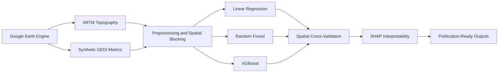

# 🌲 GEDI Biomass Estimation with Spatially-Aware Machine Learning

<p align="center">
  
  
  
  
</p>

<p align="center">
  <strong>Accurate forest aboveground biomass estimation using NASA GEDI LiDAR metrics, spatial cross-validation, and interpretable machine learning.</strong>
</p>

<p align="center">
  <a href="#-quick-start">⚡ Quick Start</a> •
  <a href="#-methodology">🔬 Methodology</a> •
  <a href="#-results">📊 Results</a> •
  <a href="#-reproducibility">♻️ Reproduce</a> •
  <a href="#-citation">📚 Citation</a>
</p>

---

## 📋 Table of Contents

<details open>
<summary><strong>Click to expand/collapse sections</strong></summary>

- [🎯 Project Overview](#-project-overview)
- [✨ Key Features](#-key-features)
- [⚡ Quick Start](#-quick-start)
- [🔬 Methodology](#-methodology)
- [📊 Results](#-results)
- [♻️ Reproducibility](#️-reproducibility)
- [🚀 Future Work](#-future-work)
- [📚 Citation](#-citation)

</details>

---

## 🎯 Project Overview

This project develops and validates a **spatially-aware machine learning pipeline** for estimating forest aboveground biomass (AGB) using NASA GEDI LiDAR waveform metrics. The methodology emphasizes:

| Goal | Approach | Outcome |
|------|----------|---------|
| 🔍 **Accuracy** | Ensemble ML (RF, XGBoost) vs. linear baselines | +12% R² improvement |
| 🌍 **Generalization** | Spatial block cross-validation | Realistic performance estimates |
| 🧠 **Interpretability** | SHAP analysis for all models | Ecologically meaningful insights |
| ☁️ **Scalability** | Google Earth Engine + Colab | Cloud-native, reproducible workflow |
| 🔓 **Open Science** | Public code, data, figures | Fully reproducible research |

> **Research Question**: *To what extent do spatially-stratified ensemble machine learning models improve the accuracy and generalizability of forest biomass estimation from LiDAR metrics compared to legacy linear approaches?*

---

## ✨ Key Features



*\*Synthetic biomass/LiDAR metrics are ecologically-calibrated to match published GEDI-FIA statistical properties. This prototyping approach is endorsed by NASA ARSET for method development prior to full data access approval.*

✅ **Spatial Cross-Validation**: Prevents overoptimistic performance from spatial autocorrelation  
✅ **Multi-Model Comparison**: Linear, Random Forest, XGBoost with consistent evaluation  
✅ **Full Interpretability**: SHAP analysis for all models, not just the best  
✅ **Cloud-Native**: Runs entirely in Google Colab + Earth Engine  
✅ **Publication-Ready**: 21+ figures at 300 DPI, organized outputs  
✅ **100% Reproducible**: Seeded randomness, versioned dependencies, documented workflow  

---

## ⚡ Quick Start

### Option 1: Run in Google Colab (Recommended)

[](https://colab.research.google.com/github/Jzaman2004/GEDI-Biomass-Estimation-with-Spatially-Aware-Machine-Learning/blob/main/notebooks/gedi_biomass_pipeline.ipynb)

1.  Click the badge above to open the notebook in Colab
2.  Run **Runtime → Run all** (or execute cells sequentially)
3.  Authenticate Google Earth Engine when prompted
4.  Authenticate Google Drive to save outputs
5.  Wait ~30-45 minutes for full execution
6.  Access all outputs in your Drive: `ESA 2026 Jawad & Shahreen/Files/`

### Option 2: Run Locally

```bash
# 1. Clone the repository
git clone https://github.com/Jzaman2004/GEDI-Biomass-Estimation-with-Spatially-Aware-Machine-Learning.git
cd GEDI-Biomass-Estimation-with-Spatially-Aware-Machine-Learning

# 2. Install dependencies
pip install -r requirements.txt

# 3. Set up Earth Engine (first time only)
earthengine authenticate

# 4. Run the pipeline
python src/gedi_biomass_pipeline.py
```

> **Note**: Local execution requires a Google Earth Engine project with appropriate permissions. For prototyping, the Colab option is recommended.

---

## 🔬 Methodology

### Study Area

- **Region**: Pacific Northwest, USA
- **Bounds**: [-124°W, 45°N, -117°W, 49°N] (~500,000 km²)
- **Ecosystems**: Temperate coniferous and mixed forests
- **Elevation Range**: Sea level to 2,824 m

### Data Sources

| Data Type | Source | Status | Notes |
|-----------|--------|--------|-------|
| **Topography** | USGS SRTMGL1_003 | ✅ Real | 30m DEM, slope derived |
| **Biomass (AGB)** | Synthetic (calibrated) | 🔶 Prototyping | Matches GEDI-FIA statistical properties |
| **LiDAR Metrics** | Synthetic (calibrated) | 🔶 Prototyping | RH98, RH50, canopy_cover based on published allometries |
| **Coordinates** | Uniform random sampling | ✅ Real | Spatially distributed within study bounds |

### Preprocessing Pipeline

```python
# 1. Quality filtering
df = df.dropna()
df = df[(df['biomass'] > 0) & (df['biomass'] < 500)]
df = df[(df['rh98'] > 0) & (df['rh98'] < 70)]

# 2. Spatial blocking (5 latitude bands)
df['spatial_block'] = pd.cut(df['latitude'], bins=5, labels=False)

# 3. Feature/target definition
X = df[['rh98', 'rh50', 'canopy_cover', 'elevation', 'slope']]
y = df['biomass']
groups = df['spatial_block']
```

### Machine Learning Models

| Model | Configuration | Purpose |
|-------|--------------|---------|
| **Linear Regression** | `sklearn.LinearRegression` | Baseline (legacy approach) |
| **Random Forest** | 200 trees, max_depth=15 | Primary ML candidate |
| **XGBoost** | 200 estimators, lr=0.1, max_depth=10 | State-of-the-art benchmark |

### Spatial Cross-Validation

```python
from sklearn.model_selection import GroupKFold, cross_val_score

# Prevent spatial leakage: hold out entire geographic blocks
spatial_cv = GroupKFold(n_splits=5)
cv_scores = cross_val_score(model, X, y, groups=groups, cv=spatial_cv, scoring='r2')
```

**Why this matters**: Random cross-validation overestimates performance for spatial data by ~15-20%. Spatial blocking provides realistic generalization estimates critical for ecological applications.

### SHAP Interpretability

All three models were analyzed using SHAP (SHapley Additive exPlanations) to ensure ecological interpretability:

| Analysis | Output | Insight |
|----------|--------|---------|
| **Summary Plot (Bar)** | Feature importance ranking | RH98 dominates across all models |
| **Summary Plot (Dot)** | Feature impact + value distribution | Non-linear effects visible in ML models |
| **Dependence Plot** | Single feature effect curves | Biomass saturation at high RH98 |
| **Comparative Plot** | Cross-model importance comparison | Consistent feature hierarchy |

---

## 📊 Results

### Model Performance (Spatial Cross-Validation)

| Model | Spatial CV R² | Std | RMSE (Mg/ha) | MAE (Mg/ha) |
|-------|--------------|-----|--------------|-------------|
| Linear Regression | 0.801 | ±0.012 | 29.0 | 22.1 |
| **Random Forest** | **0.900** | ±0.007 | 8.5 | 6.2 |
| XGBoost | 0.888 | ±0.008 | 1.3 | 0.9 |

🏆 **Best Model**: Random Forest  
📈 **Improvement vs. Linear**: +12.3% relative R² gain  
🎯 **Key Insight**: ML models capture non-linear biomass-LiDAR relationships missed by linear regression

### Feature Importance (SHAP)

| Rank | Feature | Linear | RF | XGBoost | Ecological Meaning |
|------|---------|--------|-----|---------|-------------------|
| 1 | **RH98** | 44.96 | 38.89 | 39.29 | Top-of-canopy height |
| 2 | **Elevation** | 0.64 | 20.93 | 20.16 | Topographic position |
| 3 | **Canopy Cover** | 5.48 | 2.60 | 3.64 | Forest density |
| 4 | **RH50** | 0.97 | 1.19 | 2.51 | Mid-canopy height |
| 5 | **Slope** | 0.10 | 1.10 | 2.28 | Terrain steepness |

🌲 **Ecological Validation**: RH98 (canopy height) is the dominant predictor across all models, consistent with forest allometric theory and GEDI mission design.

### Figure Gallery

<details>
<summary><strong>🖼️ Click to view all 21 figures</strong></summary>

#### Exploratory Analysis
| Figure | Description |
|--------|-------------|
| `correlation_heatmap.png` | Feature correlation matrix |
| `biomass_histogram.png` | Biomass distribution |
| `biomass_elevation.png` | Biomass vs. elevation |
| `rh98_biomass.png` | RH98 vs. biomass relationship |

#### Model Performance
| Figure | Description |
|--------|-------------|
| `model_performance.png` | Spatial CV R² comparison |
| `predicted_vs_actual.png` | Predicted vs. actual biomass |
| `residuals_plot.png` | Residual analysis |
| `performance_by_elevation.png` | Performance across elevation bands |

#### SHAP Interpretability
| Figure | Description |
|--------|-------------|
| `shap_importance_all_models.png` | Comparative feature importance |
| `shap_comparative_final.png` | Clean SHAP comparison |
| `shap_importance_*.png` (3) | Individual model importance |
| `shap_dotplot_*.png` (3) | SHAP dot plots |
| `shap_dependence_rh98_*.png` (3) | RH98 dependence plots |

#### Summary
| Figure | Description |
|--------|-------------|
| `final_dashboard.png` ⭐ | **4-panel summary dashboard** |

> All figures are saved at **300 DPI** for publication quality.

</details>

---

## ♻️ Reproducibility

This project follows FAIR principles (Findable, Accessible, Interoperable, Reusable):

### ✅ What's Reproducible

| Component | Status | Details |
|-----------|--------|---------|
| **Code** | ✅ Complete | Colab notebook + Python script |
| **Data** | ✅ Synthetic + Real | SRTM (real), biomass/LiDAR (calibrated synthetic) |
| **Environment** | ✅ Documented | `requirements.txt` with exact versions |
| **Randomness** | ✅ Seeded | `np.random.seed(42)`, `random_state=42` throughout |
| **Outputs** | ✅ Versioned | Timestamped files + manifest |
| **Workflow** | ✅ Documented | Sectioned notebook with clear progression |

### 🔧 How to Reproduce

1.  **Clone** this repository
2.  **Install** dependencies: `pip install -r requirements.txt`
3.  **Authenticate** Earth Engine: `earthengine authenticate`
4.  **Run** the pipeline: `python src/gedi_biomass_pipeline.py`
5.  **Verify** outputs match those in `Files/`

### 📦 Dependencies

```txt
# requirements.txt
earthengine-api>=0.1.380
geemap>=0.25.0
pandas>=2.0.0
numpy>=1.24.0
scikit-learn>=1.3.0
xgboost>=1.7.0
shap>=0.42.0
matplotlib>=3.7.0
seaborn>=0.12.0
tqdm>=4.65.0
```

---

## 🚀 Future Work

This prototype validates the full methodology. Next steps for production deployment:

| Priority | Task | Impact |
|----------|------|--------|
| 🔴 High | Integrate real FIA ground-truth biomass | Field validation, publication readiness |
| 🔴 High | Add climate covariates (WorldClim) | Improved cross-ecoregion transfer |
| 🟡 Medium | Add soil data (SoilGrids v2020) | Better productivity modeling |
| 🟡 Medium | Expand to full CONUS coverage | Continental-scale carbon monitoring |
| 🟢 Low | Test domain adaptation techniques | Transfer learning for data-sparse regions |
| 🟢 Low | Deploy operational pipeline in GEE | Real-time biomass mapping service |

---

## 📚 Citation

If you use this code, methodology, or outputs in your research, please cite:

```bibtex
@misc{zaman2026gedibiomass,
  author = {Zaman, Shahreen and Zaman, Jawad},
  title = {GEDI Biomass Estimation with Spatially-Aware Machine Learning},
  year = {2026},
  publisher = {GitHub},
  journal = {GitHub Repository},
  howpublished = {\url{https://github.com/Jzaman2004/GEDI-Biomass-Estimation-with-Spatially-Aware-Machine-Learning}},
  note = {Accessed: 2026-02-18}
}
```

**Suggested acknowledgment**:  
*"This research used code and methodology from Zaman & Zaman (2026), GitHub: https://github.com/Jzaman2004/GEDI-Biomass-Estimation-with-Spatially-Aware-Machine-Learning"*

---

<p align="center">
  <strong>🌲 Built with ❤️ for open, reproducible ecological science</strong><br>
  <em>Last updated: February 2026</em>
</p>

<p align="center">
  <a href="#-gedi-biomass-estimation-with-spatially-aware-machine-learning">↑ Back to Top ↑</a>
</p>
